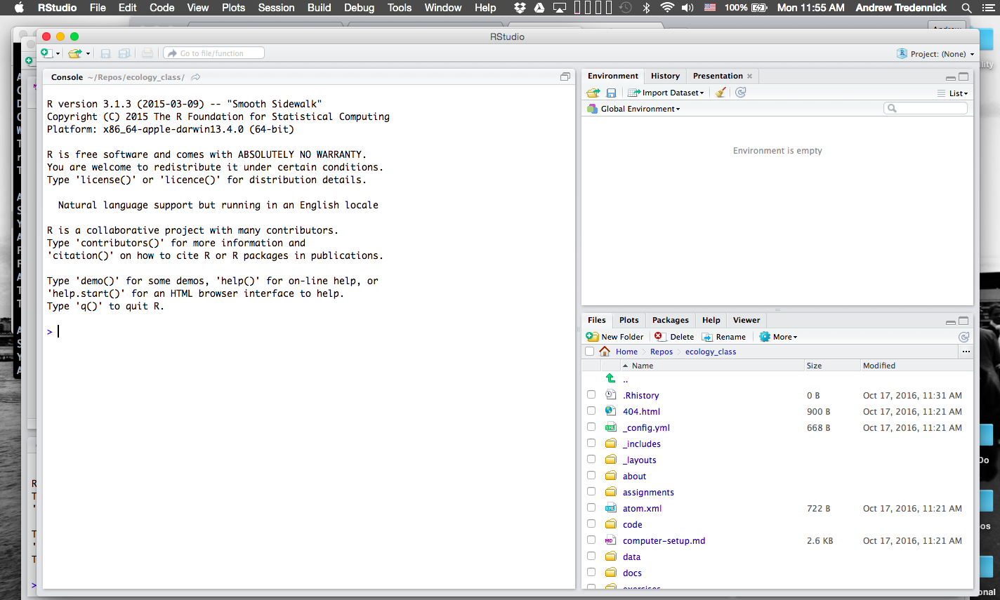

### Setting up R

1. Download and install the [R base system](http://cran.rstudio.com/). Then, install
[R studio](http://www.rstudio.com/products/rstudio/download/).

2. Next, open R Studio, at which point you should see something like this:



3. At the carrot (``>``), type ```3+3``` and hit enter (or return). At this,
point your console should look something like this:

```{rtest, eval=TRUE}
3+3
```

4. Now, assuming you are connected to the internet, type this line of code:

```{packtest, eval=FALSE}
install.packages("Matrix")
```

5. If you get no errors, you're all done! If you ran into problems at any of
the above steps, please contact me **before the second class**.
